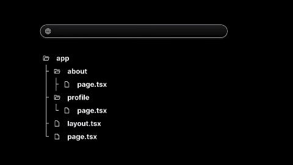
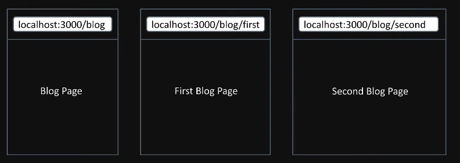
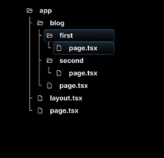
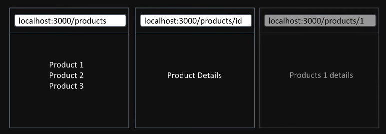
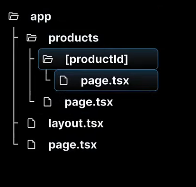
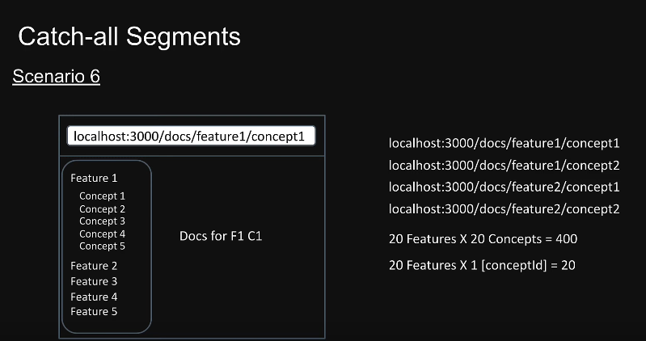
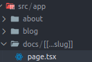

## React server componenet
- React sevrre component is a new architecture introduced by the react 18
- The architecture intoduces a new wayof creating React componenets, Splitting them into two types
  - Server components
  - Slient components
## React server compponents contd
### Server Components
- In Nextjs all components are serve components by default
- They have the ability to run task like reading files ir fetching data from a database
- However they dont have the abiliyt ti use Hooks or handke user interactions
### Client components

- To create a client componenet, Its necessary to add "use client" at the top of component file
- Clien components cant Perform tasks like reading files, but they have the ability to use hooks and manage interaction

## Routing
- Next.js has a file system based routing mechanism
- URL path that users can access in thr browser are defined by files and folders in you codebase
### Routing conventions
 - All routes must be placed inside the app folder
 - Every file that corresponds to a route must be names page.jsx or page.tsx
 - Every folder corresponds to a path sgement in the browser URL dddd
### File based Rotuing 
The routes is dependednt on the foldername of the cotaining file
for example:- /about route needs a folder structure as src/app/about/page.tsx 

### Nested routes

## Dynamic routes

## Nested Dynamic routes

## Catch all segements

- Extra [] for handling the docs route without any slug paramss
