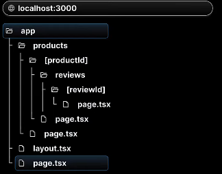
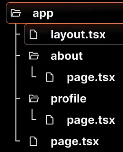

## React server componenet
- React sevrre component is a new architecture introduced by the react 18
- The architecture intoduces a new wayof creating React componenets, Splitting them into two types
  - Server components
  - Slient components
## React server compponents contd
### Server Components
- In Nextjs all components are serve components by default
- They have the ability to run task like reading files ir fetching data from a database
- However they dont have the abiliyt ti use Hooks or handke user interactions
### Client components

- To create a client componenet, Its necessary to add "use client" at the top of component file
- Clien components cant Perform tasks like reading files, but they have the ability to use hooks and manage interaction


## Routing
- Next.js has a file system based routing mechanism
- URL path that users can access in thr browser are defined by files and folders in you codebase
### Routing conventions
 - All routes must be placed inside the app folder
 - Every file that corresponds to a route must be names page.jsx or page.tsx
 - Every folder corresponds to a path sgement in the browser URL dddd
### File based Rotuing 
The routes is dependednt on the foldername of the cotaining file
for example:- /about route needs a folder structure as src/app/about/page.tsx 

### Nested routes


## Dynamic routes


## Nested Dynamic routes

## Catch all segements

- Extra [] for handling the docs route without any slug paramss

## Page not found
- The page which we see when we go to any unregitered route we see a 404 page we can customize this page
- We just have to write a `not-found.tsx` file and call it like this
```
import { notFound } from 'next/navigation'
import React from 'react'

function ReviewDetail({
    params
}:{
    params:{
        productId:string,
        reviewId:string,
    }
}) {
    if(parseInt(params.reviewId)>1000){
        notFound()
    }
  return (
    <div>ReviewDetail</div>
  )
}

export default ReviewDetail
```
## File Colocation
- As we know folder name maps to the routes, but routes to work out we need to make sure that every folder has page.tsx
## Private folders
- A Private folder indiatced that it is aprivate implementation detaul and shud not be considered bu the routing system
- The folder and all its subfolders are excluded from routing
- Prefix the folder name with an underscore

The underscore before lib make it unaccessable
### Advantges of using Private folders
- For seperating UI Logic from routing logic
- FOr consistently organizing internal files across a project
- for soritng and grouping file in code editors
- And finally for avoiding potential naming conflicts with future Next.js file conventions
- If you want to include an underscore in URL segements you can prefix the folder name with "%5f" which is the url encoded form of an underscore
- rename it to %5flib and check whetehr we can access it or nots
## Route groups               Syntax (auth)
- We usually put things related to auth after /auth route for example /auth/signin
- But we have to use `http://localhost:3000/auth/signin` 
- (auth) when we use this grouping we tell next to we are grouping all of them into one  and after using that we dont need to put for example `http://localhost:3000/signin`


## Layouts
- A page is UI that is unique to a route
- A layout is UI that is shared between multiple pages in the app
 ### How to create layouts
 - You can define a layout by default exporting a React component from a layout.js or layout.tsx
 - That component should accept a children prop that will be populated with a child page During rendering
 - Even if u dont write layout.tsx or jsx file it will be generated by the Framework by itself

 ```
 export const metadata = {
  title: 'Next.js',
  description: 'Generated by Next.js',
}

export default function RootLayout({
  children,
}: {
  children: React.ReactNode
}) {
  return (
    <html lang="en">
      <body>{children}</body>
    </html>
  )
}
```
- The pages which we will create will we passed as a props to the nextjs and will be rendered in body tag
```
export const metadata = {
  title: 'Next.js',
  description: 'Generated by Next.js',
}

export default function RootLayout({
  children,
}: {
  children: React.ReactNode
}) {
  return (

    <html lang="en">
      <body>
        <header style={{width:"100vw", height:"200px", backgroundColor:"grey"}}>
          <h1>Header</h1>
        </header>
        {children}
        <footer style={{width:"100vw", height:"200px", backgroundColor:"green"}}>
          <h1>Footer</h1>
        </footer>
        </body>
    </html>
  )
}
```
 - if we add this code in layout.tsx we can seee the header and footer in every page with the children which is passed as props

 
 ## Nested layout
 - when u add layouts in into other layout 
 
 ```

  export const metadata={
    title:"Nextjs",
    description:"Generated By nextjs"
}
export default function RootLayout({children}:{children:React.ReactNode}){
    return(

        <html lang="en">
        <body>
            <h1>List of products</h1>
            {children}
        </body>
        </html>
    )
}
```